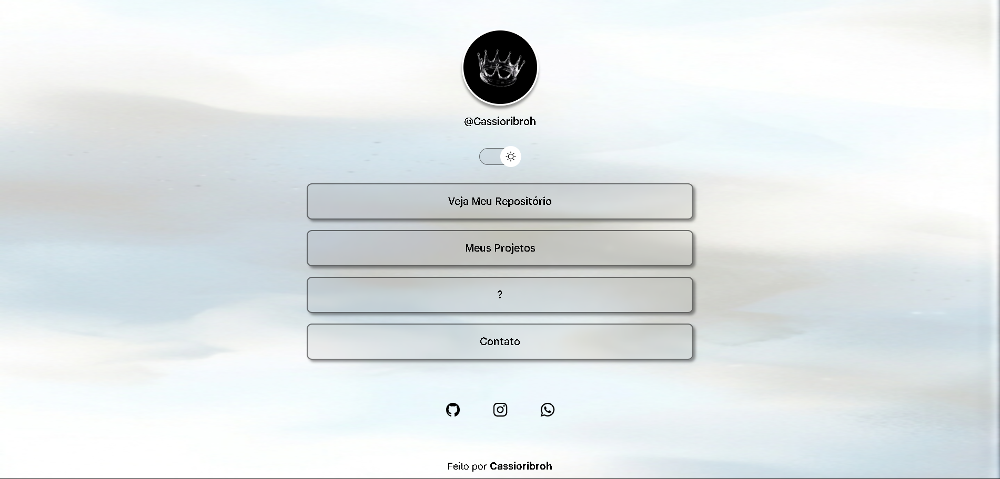
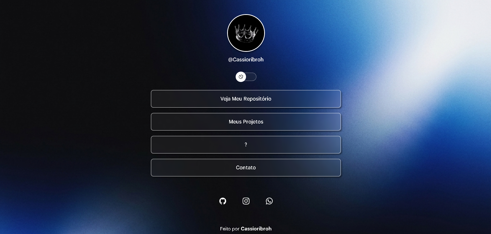

# 🌐 Projeto Bio

Uma página simples, moderna e responsiva criada para reunir minhas principais redes sociais e links importantes em um só lugar.

---

## ✨ Preview

---

## 🚀 Tecnologias Utilizadas

- HTML5
- CSS3
- JavaScript

---

## 📱 Funcionalidades

- Links para redes sociais
- Layout responsivo
- Design moderno
- Ícones personalizados
- Navegação simples e rápida

---

## 🎯 Objetivo do Projeto

O objetivo deste projeto foi praticar desenvolvimento web, organização de layout e criação de interfaces modernas utilizando tecnologias básicas do front-end.

---

## 🌍 Acesse o Projeto

Projeto disponível online através do GitHub Pages:

🔗 https://cassioribroh.github.io/projeto-bio/